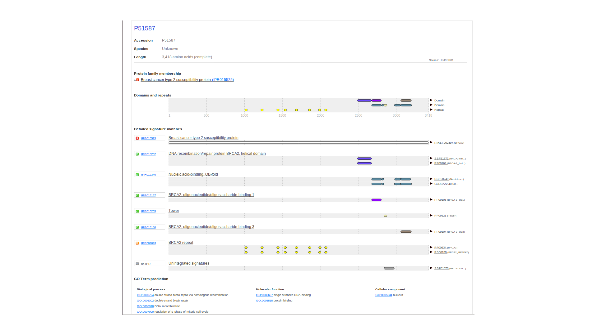

Output formats
==============

In this version of InterProScan, you can retrieve output in any of the
following five formats:

-  `TSV <OutputFormats.html#tab-separated-values-format-tsv>`__: A simple tab-delimited file format
-  `XML <OutputFormats.html#extensible-markup-language-xml>`__: The InterProScan XML format (`XSD available
   here <OutputFormats.html#the-xml-schema-definition>`__).
-  `JSON <OutputFormats.html#javascript-object-notation-json>`__: Full output of results in JSON format
-  `GFF3 <OutputFormats.html#generic-feature-format-version-3-gff3>`__: The `GFF 3.0 <http://gmod.org/wiki/GFF#GFF3_Format>`__ format
-  `HTML <OutputFormats.html#svg-and-html>`__ (deprecated): An HTML representation of the protein matches
-  `SVG <OutputFormats.html#svg-and-html>`__ (deprecated): An Scalable Vector Graphics representation of the protein
   matches

InterProScan 5 can output results for protein and nucleotide sequences
in all formats. **Please note** you can only trace protein match
positions to the original nucleotide sequence with GFF3, XML and JSON
outputs.

You can override the default output formats using the **-f** option,
e.g.:

::

    ./interproscan.sh -f XML -f JSON -i /path/to/sequences.fasta -b /path/to/output_file

or

::

    ./interproscan.sh -f XML, JSON -i /path/to/sequences.fasta -b /path/to/output_file

These two equivalent commands will output the results in XML and HTML
format.

Tab-separated values format (TSV)
---------------------------------

Basic tab delimited format. Outputs only those sequences with domain
matches.

Example output
~~~~~~~~~~~~~~

::

    P51587  14086411a2cdf1c4cba63020e1622579    3418    Pfam    PF09103 BRCA2, oligonucleotide/oligosaccharide-binding, domain 1    2670    2799    7.9E-43 T   15-03-2013
    P51587  14086411a2cdf1c4cba63020e1622579    3418    ProSiteProfiles PS50138 BRCA2 repeat profile.   1002    1036    0.0 T   18-03-2013  IPR002093   BRCA2 repeat    GO:0005515|GO:0006302
    P51587  14086411a2cdf1c4cba63020e1622579    3418    Gene3D  G3DSA:2.40.50.140       2966    3051    3.1E-52 T   15-03-2013
    ...

The TSV format presents the match data in columns as follows:

1.  Protein accession (e.g. P51587)
2.  Sequence MD5 digest (e.g. 14086411a2cdf1c4cba63020e1622579)
3.  Sequence length (e.g. 3418)
4.  Analysis (e.g. Pfam / PRINTS / Gene3D)
5.  Signature accession (e.g. PF09103 / G3DSA:2.40.50.140)
6.  Signature description (e.g. BRCA2 repeat profile)
7.  Start location
8.  Stop location
9.  Score - is the e-value (or score) of the match reported by member
    database method (e.g. 3.1E-52)
10. Status - is the status of the match (T: true)
11. Date - is the date of the run
12. InterPro annotations - accession (e.g. IPR002093)
13. InterPro annotations - description (e.g. BRCA2 repeat)
14. (GO annotations (e.g. GO:0005515) - optional column; only displayed
    if --goterms option is switched on)
15. (Pathways annotations (e.g. REACT\_71) - optional column; only
    displayed if --pathways option is switched on)

If a value is missing in a column, for example, the match has no InterPro annotation, a '-' is displayed.

Extensible Markup Language (XML)
--------------------------------

XML representation of the matches - this is the richest form of the
data. The XML Schema Definition (XSD) file links are below the example output. 

Example output
~~~~~~~~~~~~~~

::

    <?xml version="1.0" encoding="UTF-8" standalone="yes"?>
    <protein-matches xmlns="http://www.ebi.ac.uk/interpro/resources/schemas/interproscan5" interproscan-version="5.26-65.0">
        <protein>
            <sequence md5="14086411a2cdf1c4cba63020e1622579">MPIGSKERPTFFEIFKTRCNKADLGPISLNWFEELSSEAPPYNSEPAEESEHKNNNYEPNLFKTPQRKPSYNQLASTPIIFKEQGLTLPLYQSPVKELDKFKLDLGRNVPNSRHKSLRTVKTKMDQADDVSCPLLNSCLSESPVVLQCTHVTPQRDKSVVCGSLFHTPKFVKGRQTPKHISESLGAEVDPDMSWSSSLATPPTLSSTVLIVRNEEASETVFPHDTTANVKSYFSNHDESLKKNDRFIASVTDSENTNQREAASHGFGKTSGNSFKVNSCKDHIGKSMPNVLEDEVYETVVDTSEEDSFSLCFSKCRTKNLQKVRTSKTRKKIFHEANADECEKSKNQVKEKYSFVSEVEPNDTDPLDSNVAHQKPFESGSDKISKEVVPSLACEWSQLTLSGLNGAQMEKIPLLHISSCDQNISEKDLLDTENKRKKDFLTSENSLPRISSLPKSEKPLNEETVVNKRDEEQHLESHTDCILAVKQAISGTSPVASSFQGIKKSIFRIRESPKETFNASFSGHMTDPNFKKETEASESGLEIHTVCSQKEDSLCPNLIDNGSWPATTTQNSVALKNAGLISTLKKKTNKFIYAIHDETSYKGKKIPKDQKSELINCSAQFEANAFEAPLTFANADSGLLHSSVKRSCSQNDSEEPTLSLTSSFGTILRKCSRNETCSNNTVISQDLDYKEAKCNKEKLQLFITPEADSLSCLQEGQCENDPKSKKVSDIKEEVLAAACHPVQHSKVEYSDTDFQSQKSLLYDHENASTLILTPTSKDVLSNLVMISRGKESYKMSDKLKGNNYESDVELTKNIPMEKNQDVCALNENYKNVELLPPEKYMRVASPSRKVQFNQNTNLRVIQKNQEETTSISKITVNPDSEELFSDNENNFVFQVANERNNLALGNTKELHETDLTCVNEPIFKNSTMVLYGDTGDKQATQVSIKKDLVYVLAEENKNSVKQHIKMTLGQDLKSDISLNIDKIPEKNNDYMNKWAGLLGPISNHSFGGSFRTASNKEIKLSEHNIKKSKMFFKDIEEQYPTSLACVEIVNTLALDNQKKLSKPQSINTVSAHLQSSVVVSDCKNSHITPQMLFSKQDFNSNHNLTPSQKAEITELSTILEESGSQFEFTQFRKPSYILQKSTFEVPENQMTILKTTSEECRDADLHVIMNAPSIGQVDSSKQFEGTVEIKRKFAGLLKNDCNKSASGYLTDENEVGFRGFYSAHGTKLNVSTEALQKAVKLFSDIENISEETSAEVHPISLSSSKCHDSVVSMFKIENHNDKTVSEKNNKCQLILQNNIEMTTGTFVEEITENYKRNTENEDNKYTAASRNSHNLEFDGSDSSKNDTVCIHKDETDLLFTDQHNICLKLSGQFMKEGNTQIKEDLSDLTFLEVAKAQEACHGNTSNKEQLTATKTEQNIKDFETSDTFFQTASGKNISVAKESFNKIVNFFDQKPEELHNFSLNSELHSDIRKNKMDILSYEETDIVKHKILKESVPVGTGNQLVTFQGQPERDEKIKEPTLLGFHTASGKKVKIAKESLDKVKNLFDEKEQGTSEITSFSHQWAKTLKYREACKDLELACETIEITAAPKCKEMQNSLNNDKNLVSIETVVPPKLLSDNLCRQTENLKTSKSIFLKVKVHENVEKETAKSPATCYTNQSPYSVIENSALAFYTSCSRKTSVSQTSLLEAKKWLREGIFDGQPERINTADYVGNYLYENNSNSTIAENDKNHLSEKQDTYLSNSSMSNSYSYHSDEVYNDSGYLSKNKLDSGIEPVLKNVEDQKNTSFSKVISNVKDANAYPQTVNEDICVEELVTSSSPCKNKNAAIKLSISNSNNFEVGPPAFRIASGKIVCVSHETIKKVKDIFTDSFSKVIKENNENKSKICQTKIMAGCYEALDDSEDILHNSLDNDECSTHSHKVFADIQSEEILQHNQNMSGLEKVSKISPCDVSLETSDICKCSIGKLHKSVSSANTCGIFSTASGKSVQVSDASLQNARQVFSEIEDSTKQVFSKVLFKSNEHSDQLTREENTAIRTPEHLISQKGFSYNVVNSSAFSGFSTASGKQVSILESSLHKVKGVLEEFDLIRTEHSLHYSPTSRQNVSKILPRVDKRNPEHCVNSEMEKTCSKEFKLSNNLNVEGGSSENNHSIKVSPYLSQFQQDKQQLVLGTKVSLVENIHVLGKEQASPKNVKMEIGKTETFSDVPVKTNIEVCSTYSKDSENYFETEAVEIAKAFMEDDELTDSKLPSHATHSLFTCPENEEMVLSNSRIGKRRGEPLILVGEPSIKRNLLNEFDRIIENQEKSLKASKSTPDGTIKDRRLFMHHVSLEPITCVPFRTTKERQEIQNPNFTAPGQEFLSKSHLYEHLTLEKSSSNLAVSGHPFYQVSATRNEKMRHLITTGRPTKVFVPPFKTKSHFHRVEQCVRNINLEENRQKQNIDGHGSDDSKNKINDNEIHQFNKNNSNQAAAVTFTKCEEEPLDLITSLQNARDIQDMRIKKKQRQRVFPQPGSLYLAKTSTLPRISLKAAVGGQVPSACSHKQLYTYGVSKHCIKINSKNAESFQFHTEDYFGKESLWTGKGIQLADGGWLIPSNDGKAGKEEFYRALCDTPGVDPKLISRIWVYNHYRWIIWKLAAMECAFPKEFANRCLSPERVLLQLKYRYDTEIDRSRRSAIKKIMERDDTAAKTLVLCVSDIISLSANISETSSNKTSSADTQKVAIIELTDGWYAVKAQLDPPLLAVLKNGRLTVGQKIILHGAELVGSPDACTPLEAPESLMLKISANSTRPARWYTKLGFFPDPRPFPLPLSSLFSDGGNVGCVDVIIQRAYPIQWMEKTSSGLYIFRNEREEEKEAAKYVEAQQKRLEALFTKIQEEFEEHEENTTKPYLPSRALTRQQVRALQDGAELYEAVKNAADPAYLEGYFSEEQLRALNNHRQMLNDKKQAQIQLEIRKAMESAEQKEQGLSRDVTTVWKLRIVSYSKKEKDSVILSIWRPSSDLYSLLTEGKRYRIYHLATSKSKSKSERANIQLAATKKTQYQQLPVSDEILFQIYQPREPLHFSKFLDPDFQPSCSEVDLIGFVVSVVKKTGLAPFVYLSDECYNLLAIKFWIDLNEDIIKPHMLIAASNLQWRPESKSGLLTLFAGDFSVFSASPKEGHFQETFNKMKNTVENIDILCNEAENKLMHILHANDPKWSTPTKDCTSGPYTAQIIPGTGNKLLMSSPNCEIYYQSPLSLCMAKRKSVSTPVSAQMTSKSCKGEKEIDDQKNCKKRRALDFLSRLPLPPPVSPICTFVSPAAQKAFQPPRSCGTKYETPIKKKELNSPQMTPFKKFNEISLLESNSIADEELALINTQALLSGSTGEKQFISVSESTRTAPTSSEDYLRLKRRCTTSLIKEQESSQASTEECEKNKQDTITTKKYI</sequence>
            <xref id="P51587"/>
            <matches>
    ...
                <hmmer3-match score="341.9" evalue="0.0">
                    <signature name="BRCA-2_helical" desc="BRCA2, helical" ac="PF09169">
                        <entry type="DOMAIN" name="BRCA2_hlx" desc="Breast cancer type 2 susceptibility protein, helical domain" ac="IPR015252">
                            <go-xref category="BIOLOGICAL_PROCESS" name="double-strand break repair via homologous recombination" id="GO:0000724" db="GO"/>
                            <go-xref category="MOLECULAR_FUNCTION" name="single-stranded DNA binding" id="GO:0003697" db="GO"/>
                            <go-xref category="BIOLOGICAL_PROCESS" name="DNA recombination" id="GO:0006310" db="GO"/>
                        </entry>
                        <models>
                            <model name="BRCA-2_helical" desc="BRCA2, helical" ac="PF09169"/>
                        </models>
                        <signature-library-release version="27.0" library="PFAM"/>
                    </signature>
                    <locations>
                        <hmmer3-location env-start="2479" env-end="2667" hmm-end="195" hmm-start="1" evalue="9.6E-102" score="0.0" end="2667" start="2479"/>
                    </locations>
                </hmmer3-match>
    ...
                <superfamilyhmmer3-match evalue="0.0">
                    <signature name="BRCA2 helical domain" ac="SSF81872">
                        <entry type="DOMAIN" name="BRCA2_hlx" desc="Breast cancer type 2 susceptibility protein, helical domain" ac="IPR015252">
                            <go-xref category="BIOLOGICAL_PROCESS" name="double-strand break repair via homologous recombination" id="GO:0000724" db="GO"/>
                            <go-xref category="MOLECULAR_FUNCTION" name="single-stranded DNA binding" id="GO:0003697" db="GO"/>
                            <go-xref category="BIOLOGICAL_PROCESS" name="DNA recombination" id="GO:0006310" db="GO"/>
                        </entry>
                        <models>
                            <model name="BRCA2 helical domain" ac="0039279"/>
                            <model name="BRCA2 helical domain" ac="0040951"/>
                        </models>
                        <signature-library-release version="1.75" library="SUPERFAMILY"/>
                    </signature>
                    <locations>
                        <superfamilyhmmer3-location end="2668" start="2479"/>
                    </locations>
                </superfamilyhmmer3-match>
    ...
                <rpsblast-match>
                    <signature ac="cd08964" desc="L-asparaginase_II" name="L-asparaginase_II">
                        <models>
                            <model ac="cd08964" desc="L-asparaginase_II" name="L-asparaginase_II"/>
                        </models>
                        <signature-library-release library="CDD" version="3.14"/>
                    </signature>
                    <locations>
                        <rpsblast-location evalue="8.66035E-152" score="433.09" start="50" end="364">
                            <sites>
                                <rpsblast-site description="homotetramer interface" numLocations="51">
    <site-locations>
        <site-location residue="Y" start="271" end="271"/>
        <site-location residue="R" start="246" end="246"/>
        <site-location residue="Y" start="229" end="229"/>
        ...
    </site-locations>
                                </rpsblast-site>
                                ...
                            </sites>
                        </rpsblast-location>
                    </locations>
                </rpsblast-match>
                ...
            </matches>
        </protein>
    </protein-matches>

The XML Schema Definition
-------------------------
The XML Schema Definition (XSD) is available
`here <http://ftp.ebi.ac.uk/pub/software/unix/iprscan/5/schemas/>`__.

Listed below are the XSD files for the InterProScan 5 XML output format (with the InterProScan release versions they apply to noted in brackets afterwards).
- `interproscan-model-4.5.xsd <http://ftp.ebi.ac.uk/pub/software/unix/iprscan/5/schemas/interproscan-model-4.5.xsd>`__ (as produced by InterProScan 5 from version 5.51-85.0 onwards)
- `interproscan-model-3.0.xsd <http://ftp.ebi.ac.uk/pub/software/unix/iprscan/5/schemas/interproscan-model-3.0.xsd>`__ (as produced by InterProScan 5 from version 5.31-70.0 onwards)
- `interproscan-model-2.2.xsd <http://ftp.ebi.ac.uk/pub/software/unix/iprscan/5/schemas/interproscan-model-2.2.xsd>`__ (as produced by InterProScan 5 from version 5.28-67.0 to 5.30-69.0)
- `interproscan-model-2.1.xsd <http://ftp.ebi.ac.uk/pub/software/unix/iprscan/5/schemas/interproscan-model-2.1.xsd>`__ (as produced by InterProScan 5 from version 5.26-65.0 to 5.27-66.0)
- `interproscan-model-2.0.xsd <http://ftp.ebi.ac.uk/pub/software/unix/iprscan/5/schemas/interproscan-model-2.0.xsd>`__ (as produced by InterProScan 5 from version 5.21-60.0 to 5.25-64.0)
- `interproscan-model-1.4.xsd <http://ftp.ebi.ac.uk/pub/software/unix/iprscan/5/schemas/interproscan-model-1.4.xsd>`__ (as produced by InterProScan 5 in version 5.20-59.0 only)
- `interproscan-model-1.3.xsd <http://ftp.ebi.ac.uk/pub/software/unix/iprscan/5/schemas/interproscan-model-1.3.xsd>`__ (as produced by InterProScan 5 in version 5.19-58.0 only)
- `interproscan-model-1.2.xsd <http://ftp.ebi.ac.uk/pub/software/unix/iprscan/5/schemas/interproscan-model-1.2.xsd>`__ (as produced by InterProScan 5 from version 5.17-56.0 to 5.18-57.0)
- `interproscan-model-1.1.xsd <htpp://ftp.ebi.ac.uk/pub/software/unix/iprscan/5/schemas/interproscan-model-1.1.xsd>`__ (as produced by InterProScan 5 from version RC7 to 5.16-55.0)
- `interproscan-model-1.0.xsd <http://ftp.ebi.ac.uk/pub/software/unix/iprscan/5/schemas/interproscan-model-1.0.xsd>`__ (InterProScan 5 version RC1 to RC6)

JavaScript Object Notation (JSON)
---------------------------------

JSON representation of the matches - an alternative to XML format. As
new releases are made public, the changes to the expected JSON format
are documented in :ref:`Change log for InterProScan JSON output format`.

Example output
~~~~~~~~~~~~~~

::

    {
     "interproscan-version": "5.26-65.0",
    "results": [{
      "sequence" : "MSKIGKSIRLERIIDRKTRKTVIVPMDHGLTVGPIPGLIDLAAAVDKVAEGGANAVLGHMGLPLYGHRGYGKDVGLIIHLSASTSLGPDANHKVLVTRVEDAIRVGADGVSIHVNVGAEDEAEMLRDLGMVARRCDLWGMPLLAMMYPRGAKVRSEHSVEYVKHAARVGAELGVDIVKTNYTGSPETFREVVRGCPAPVVIAGGPKMDTEADLLQMVYDAMQAGAAGISIGRNIFQAENPTLLTRKLSKIVHEGYTPEEAARLKL",
      "md5" : "88d47cc807fe8e977130b0cc93e0bd61",
      "matches" : [ {
        "signature" : {
          "accession" : "PIRSF038992",
          "name" : "Aldolase_Ia",
          "description" : null,
          "type" : null,
          "signatureLibraryRelease" : {
            "library" : "PIRSF",
            "version" : "3.01"
          },
          "models" : {
            "PIRSF038992" : {
              "accession" : "PIRSF038992",
              "name" : "Aldolase_Ia",
              "description" : null,
              "key" : "PIRSF038992"
            }
          },
          "entry" : {
            "accession" : "IPR002915",
            "name" : "DeoC/FbaB/lacD_aldolase",
            "description" : "DeoC/FbaB/ lacD aldolase",
            "type" : "FAMILY",
            "goXRefs" : [ {
              "identifier" : "GO:0016829",
              "name" : "lyase activity",
              "databaseName" : "GO",
              "category" : "MOLECULAR_FUNCTION"
            } ],
            "pathwayXRefs" : [ {
              "identifier" : "R-HSA-71336",
              "name" : "Pentose phosphate pathway (hexose monophosphate shunt)",
              "databaseName" : "Reactome"
            }, {
              "identifier" : "R-HSA-6798695",
              "name" : "Neutrophil degranulation",
              "databaseName" : "Reactome"
            } ]
          }
        },
        "locations" : [ {
          "start" : 1,
          "end" : 265,
          "hmmStart" : 2,
          "hmmEnd" : 262,
          "hmmBounds" : "INCOMPLETE",
          "evalue" : 3.3E-94,
          "score" : 302.6,
          "envelopeStart" : 1,
          "envelopeEnd" : 265
        } ],
        "evalue" : 3.0E-94,
        "score" : 302.7
      }, {
        ...
    }]
    }

Generic Feature Format Version 3 (GFF3)
---------------------------------------

The GFF3 format is a flat tab-delimited file, which is much richer then
the TSV output format. It allows you to trace back from matches to
predicted proteins and to nucleic acid sequences. It also contains a
FASTA format representation of the predicted protein sequences and their
matches. You will find a documentation of all the columns and attributes
used on http://www.sequenceontology.org/gff3.shtml.

**Please note** in GFF3 sequence identifiers "...may contain any
characters, but must escape any characters not in the set..." (1)

::

    a-zA-Z0-9.:^*$@!+_?-|.

1. http://www.sequenceontology.org/gff3.shtml

Example output
~~~~~~~~~~~~~~

::

    ##gff-version 3
    ##feature-ontology http://song.cvs.sourceforge.net/viewvc/song/ontology/sofa.obo?revision=1.269
    ##interproscan-version 5.26-65.0
    ##sequence-region AACH01000027 1 1347
    ##seqid|source|type|start|end|score|strand|phase|attributes
    AACH01000027    provided_by_user    nucleic_acid    1   1347    .   +   .   Name=AACH01000027;md5=b2a7416cb92565c004becb7510f46840;ID=AACH01000027
    AACH01000027    getorf  ORF 1   1347    .   +   .   Name=AACH01000027.2_21;Target=pep_AACH01000027_1_1347 1 449;md5=b2a7416cb92565c004becb7510f46840;ID=orf_AACH01000027_1_1347
    AACH01000027    getorf  polypeptide 1   449 .   +   .   md5=fd0743a673ac69fb6e5c67a48f264dd5;ID=pep_AACH01000027_1_1347
    AACH01000027    Pfam    protein_match   84  314 1.2E-45 +   .   Name=PF00696;signature_desc=Amino acid kinase family;Target=null 84 314;status=T;ID=match$8_84_314;Ontology_term="GO:0008652";date=15-04-2013;Dbxref="InterPro:IPR001048","Reactome:REACT_13"
    ##sequence-region 2
    ...
    >pep_AACH01000027_1_1347
    LVLLAAFDCIDDTKLVKQIIISEIINSLPNIVNDKYGRKVLLYLLSPRDPAHTVREIIEV
    LQKGDGNAHSKKDTEIRRREMKYKRIVFKVGTSSLTNEDGSLSRSKVKDITQQLAMLHEA
    GHELILVSSGAIAAGFGALGFKKRPTKIADKQASAAVGQGLLLEEYTTNLLLRQIVSAQI
    LLTQDDFVDKRRYKNAHQALSVLLNRGAIPIINENDSVVIDELKVGDNDTLSAQVAAMVQ
    ADLLVFLTDVDGLYTGNPNSDPRAKRLERIETINREIIDMAGGAGSSNGTGGMLTKIKAA
    TIATESGVPVYICSSLKSDSMIEAAEETEDGSYFVAQEKGLRTQKQWLAFYAQSQGSIWV
    DKGAAEALSQYGKSLLLSGIVEAEGVFSYGDIVTVFDKESGKSLGKGRVQFGASALEDML
    RSQKAKGVLIYRDDWISITPEIQLLFTEF
    ...
    >match$8_84_314
    KRIVFKVGTSSLTNEDGSLSRSKVKDITQQLAMLHEAGHELILVSSGAIAAGFGALGFKK
    RPTKIADKQASAAVGQGLLLEEYTTNLLLRQIVSAQILLTQDDFVDKRRYKNAHQALSVL
    LNRGAIPIINENDSVVIDELKVGDNDTLSAQVAAMVQADLLVFLTDVDGLYTGNPNSDPR
    AKRLERIETINREIIDMAGGAGSSNGTGGMLTKIKAATIATESGVPVYICS

SVG and HTML
------------

**Scalable Vector Graphics (SVG) and HyperText Markup Language (HTML)**

These two graphical output formats are now deprecated! HTML is not available for
InterProScan-5.48-83.0 and later versions. SVG will be removed in the second quarter of 2021.

We have always aimed at providing the protein sequence view in InterProScan's
HTML and SVG outputs to be almost exactly the same as the protein view on `the
website <http://www.ebi.ac.uk/interpro>`__. But with the released of a new website with cool
features at the end of 2019, maintaining the HTML and SVG outputs formats
in InterProScan became unsustainable.

However, we have a new  `**import feature on the website**
<https://www.ebi.ac.uk/interpro/result/InterProScan/#table>`__, where after you import
an InterProScan JSON output,
you can get a nice graphical view of your results and can export the results into PNG, PDF etc.

We would appreciate any feedback on this feature, `send us some comments using
EMBL EBI's support form <http://www.ebi.ac.uk/support/interproscan>`__

In the previous versions before InterProScan-5.48-83.0,
InterProScan outputs a single HTML/SVG file for each protein sequence
analysed. The HTML/SVG file(s) are compressed into a single gzipped tar
archive (or "tarball") that includes the resources (images, Javascript,
style etc) to render the pages/images in a browser or image viewer.
(Note that from version 5RC4, the SVG format has no external
dependencies.)

The tarball will be named something similar to:

::

    base_output_file_name.html.tar.gz OR base_output_file_name.svg.tar.gz

To access the HTML pages/SVG images, unzip the tarball using a command
like:

::

    tar -xvzf base_output_file_name.html(svg).tar.gz

You can then open the unzipped HTML/SVG files in any browser or image
viewer (for SVG).

Example output
~~~~~~~~~~~~~~

   SVG example output
